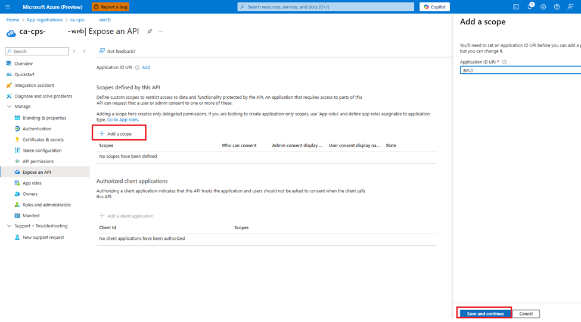
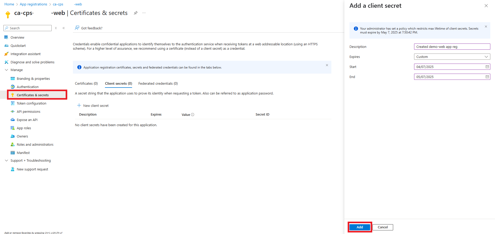
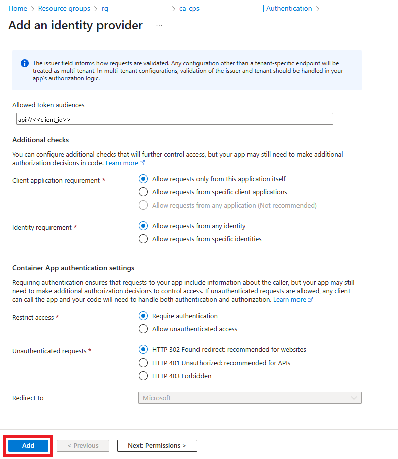

# Manual App Registration Configuration
This guide provides detailed steps to manually register both front-end and backend applications in Azure if automated registration is not an option due to security in place in your tenant and subscription.

## Prerequisites

- Access to **Microsoft Entra ID**
- Necessary permissions to create and manage **App Registrations** in your Azure tenant

## Step 1: Register the Web Application
### 1. Create App Registration
- Go to **Azure Portal** > **Microsoft Entra ID** > **Manage** > **App registrations**
- Click **+ New registration**
- Name the app (e.g., `cps-app-web`)
- Under **Redirect URI**, choose **Web** and enter:

  ```
  https://<web-app-url>azurecontainerapps.io/auth/login/aad/callback
  ```

  To find your Web App URL:
  - Navigate to your newly deployed resource group in the Azure Portal.
  - Locate the container app ending in `-web`.
  - Copy the Ingress URL from the Overview .

- Click **Register**  
  


### 2. Expose an API

- Navigate to **Expose an API**
- Click **+ Add a scope**
  - It will auto-fill the Application ID URI (use default or adjust as needed)
  - Click **Save and continue**
  - Add scope:
  - Scope name: `user_impersonation`
  - Admin consent display name: `Access Web App`
  - Admin consent description: `Allows the app to access the web application as the signed-in user`
- Click **Add scope**  
  


### 3. Configure Certificates and Secrets

- Go to **Certificates & secrets**
- Click **+ New client secret**
- Description: Provide a meaningful name to identify the secret
- Expires: Select from the options or define a custom range
- Start (Optional for custom range): Set the starting date of the secret's validity
- End (Optional for custom range): Set the ending date of the secret's validity
- Click **Add** and remember to copy and store the secret value securely as it will not be shown again


### 3. Get Tenant ID
- Go to **Tenant Properties** in [Azure Portal](https://portal.azure.com)
- Copy the Tenant ID (will be used in next step)


### 4. Set Up Authentication in Web Container App

- Go to your Web Container App
- Go to **Authentication**
- Click **Add Identity Provider**
- Choose **Microsoft**
- Input:
  - **Client ID**: The Application (client) ID from the app registration
  - **Client Secret**: The secret value you generated in Certificates & Secrets from the app registration
  - **Issuer URL**: `https://sts.windows.net/<tenant_id>/v2.0`
  - **Allowed Token Audiences**: Usually the Application ID URI or Client ID
- Click **Add**  
  


## Step 2: Register API Application

### 1. Create App Registration
- Go to **Azure Portal** > **Microsoft Entra ID** > **Manage** > **App registrations**
- Click **+ New registration**
- Name the app (e.g., `cps-app-api`)
- Under **Redirect URI**, choose **Web** and enter:

  ```
  https://<api-app-url>azurecontainerapps.io/auth/login/aad/callback
  ```

  To find your Web App URL:
  - Navigate to your newly deployed resource group in the Azure Portal.
  - Locate the container app ending in `-api`.
  - Copy the Ingress URL from the Overview .

- Click **Register**  
  

  ### 2. Expose an API

- Go to **Expose an API**
- Click **+ Add a scope**
- Use default Application ID URI
- Add:
  - Scope name: `user_impersonation`
  - Admin consent details
- Click **Add scope**  


### 3. Configure Certificates and Secrets

- Go to **Certificates & secrets**
- Click **+ New client secret**
- Description: Provide a meaningful name to identify the secret
- Expires: Select from the options or define a custom range
- Start (Optional for custom range): Set the starting date of the secret's validity
- End (Optional for custom range): Set the ending date of the secret's validity
- Click **Add** and remember to copy and store the secret value securely as it will not be shown again


### 4. Set Up Authentication in API Container App

- Navigate to your API Container App
- Go to **Authentication**
- Click **Add Identity Provider**
  - Choose **Microsoft**
  - Fill in:
    - **Client ID**: The Application (client) ID from the app registration
    - **Client Secret**: The secret value you generated in Certificates & Secrets
    - **Issuer URL**: `https://sts.windows.net/<tenant_id>/v2.0`
    - **Allowed Token Audiences**: Usually the Application ID URI or Client ID
- Click **Add**  



---

## Conclusion

You have now manually configured Azure App Registrations.

For further configuration and steps, proceed to Step 2 in [Configure App Authentication](./ConfigureAppAuthentication.md#step-2-configure-application-registration---web-application).